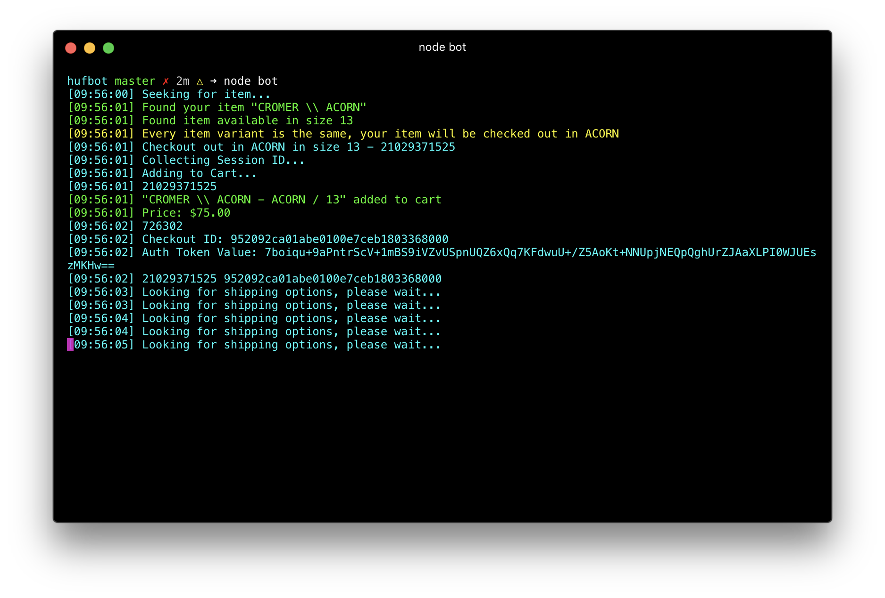

# hufbot
ATC Bot for hufworldwide.com (Shopify based website)



### Installation

hufbot requires [Node.js](http://nodejs.org/).

Setup:

```sh
$ cd hufbot
$ npm install
```

Configure information inside the `config.example.json` be sure to rename it to `config.json` when you're done.
Please note that the config file contains an array or Objects in which you can modify and add as many Objects (tasks)
as you want if you want to buy more than one item at a time.

License
----

hufbot is licensed under the MIT license.
